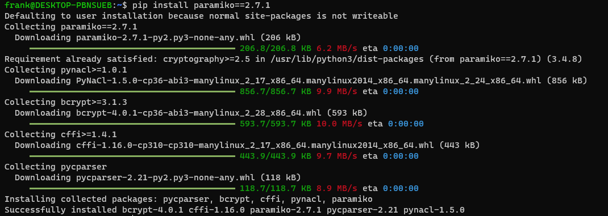
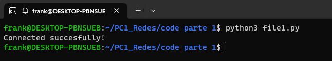
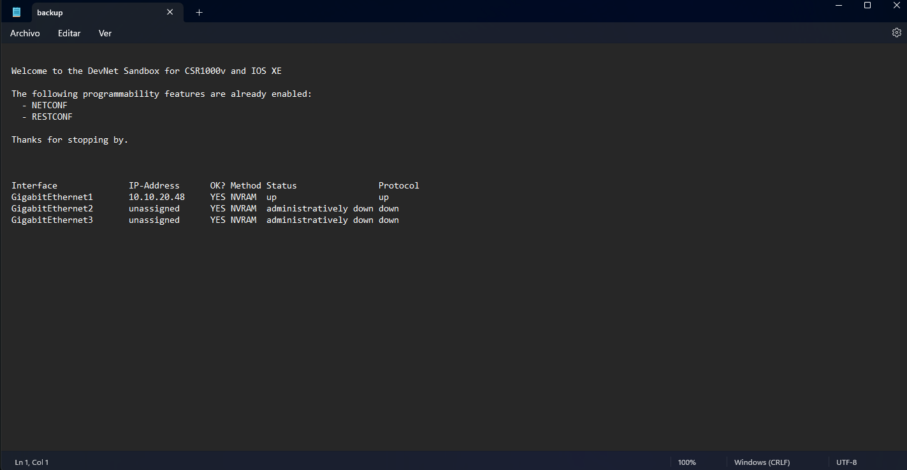
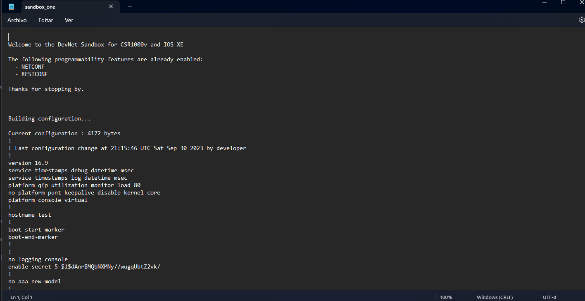

# Caratula

> UNIVERSIDAD NACIONAL DE INGENIERIA
> 
> Ciencia de la Computación
> 
> CC332 - Administración de redes
> 
> Facultad de Ciencias
> 
> Practica Calificada N°1
> 
> Profesor: Yuri Ccoica
> 
> Alumno: Franklin Espinoza Pari
> 
> Fecha: 30/09/2023

# Instalacion de Paramiko

Usaremos el comando `pip install paramiko==2.7.1`, donde le especificamos la version a instalar.

# Iniciar una sesión SSH con Paramiko

1) Importamos el módulo paramiko.client. Este módulo proporciona una biblioteca para conectar y ejecutar comandos en dispositivos remotos a través de SSH.
2) Definimos las credenciales de usuario y host para la conexión SSH.
3) Creamos un objeto SSHClient. Este objeto representa una conexión SSH al dispositivo remoto.
4) Establecemos la política de claves de host faltantes en AutoAddPolicy(). Esto significa que el cliente SSH aceptará automáticamente las nuevas claves de host que no estén en la lista de claves conocidas.
5) Cargamos las claves de host conocidas del sistema operativo local.
6) Intentamos conectarnos al dispositivo remoto usando las credenciales especificadas.
7) Si la conexión es exitosa, se imprime un mensaje de éxito.
8) Si la conexión no es exitosa, se imprime un mensaje de error.
9) Finalmente, cerramos la conexión SSH.

~~~
from paramiko.client import SSHClient
from paramiko.client import SSHClient, AutoAddPolicy

# Credentials here are for a always-on Sandbox from Cisco DevNet
SSH_USER = "developer"
SSH_PASSWORD = "lastorangerestoreball8876"
SSH_HOST = "sandbox-iosxe-recomm-1.cisco.com"
SSH_PORT = 22 # Change this if your SSH port is different

client = SSHClient()
client.set_missing_host_key_policy(AutoAddPolicy())
client.load_system_host_keys()
try:
    client.connect(SSH_HOST, port=SSH_PORT,
                             username=SSH_USER,
                             password=SSH_PASSWORD,
                             look_for_keys=False)
    print("Connected succesfully!")
except Exception:
    print("Failed to establish connection.")
finally:
    client.close()
~~~

Antes de finalizar, para las variables no secretas como el host, user, y puerto podemos usarl la funcion `input()`, y la libreria `getpass` nos permite usar una solicitud de contraseña dedicada que oculte lo que se ha escrito. 
~~~
import getpass
SSH_PASSWORD = getpass.getpass(prompt='Password: ', stream=None)
SSH_USER = input("Username: ")
SSH_HOST = input("Host: ")
SSH_PORT = int(input("Port: "))
~~~

# Ejecutando un comando a través de SSH

Para poder ejecutar un comando en el dispositivo remoto, se puede usar el método `exec_command()` del objeto `SSHClient`. Este método devuelve un objeto `PTY` que representa la sesión de terminal remota.

El objeto `PTY` tiene tres flujos asociados:

- `stdout`: El flujo de salida estándar del comando ejecutado.
- `stderr`: El flujo de salida de error del comando ejecutado.
- `stdin`: El flujo de entrada estándar del comando ejecutado.

Para poder leer la salida del comando ejecutado, podemos usar el método `read()` del flujo `stdout`. Para leer los errores del comando ejecutado, puedes usar el método `read()` del flujo `stderr`. Finalmente, para enviar texto al comando ejecutado, puedes usar el método `write()` del flujo `stdin`.

~~~
import time
from paramiko.client import SSHClient,AutoAddPolicy

# Credentials here are for a always-on Sandbox from Cisco DevNet
SSH_USER = "developer"
SSH_PASSWORD = "lastorangerestoreball8876"
SSH_HOST = "sandbox-iosxe-recomm-1.cisco.com"
SSH_PORT = 22 # Change this if your SSH port is different

client = SSHClient()
client.load_system_host_keys()
client.set_missing_host_key_policy(AutoAddPolicy())

client.connect(SSH_HOST, port=SSH_PORT,
                         username=SSH_USER,
                         password=SSH_PASSWORD,
                         look_for_keys=False)

CMD = "show ip interface brief" # You can issue any command you want
stdin, stdout, stderr = client.exec_command(CMD)
# Read the output of the command
time.sleep(5)
client.close()

~~~

# Leer la salida de un comando

En el archivo anterior se envio una linea de comando a ejecutar, sin embargo; 
no se logra observar la salida de este mismo. Por lo que leeremos nuestra salida con el metodo del cliente `stdout.readlines()`. Finalmente lo guardaremos en un archivo `backup.txt`.

~~~
from paramiko.client import SSHClient

# Credentials here are for a always-on Sandbox from Cisco DevNet
SSH_USER = "developer"
SSH_PASSWORD = "lastorangerestoreball8876"
SSH_HOST = "sandbox-iosxe-recomm-1.cisco.com"
SSH_PORT = 22 # Change this if your SSH port is different

client = SSHClient()
client.load_system_host_keys()
client.set_missing_host_key_policy(AutoAddPolicy())

client.connect(SSH_HOST, port=SSH_PORT,
                         username=SSH_USER,
                         password=SSH_PASSWORD,
                         look_for_keys=False)

CMD = "show ip interface brief" # You can issue any command you want
stdin, stdout, stderr = client.exec_command(CMD)
output = stdout.readlines()
with open("backup.txt", "w") as out_file:
    for line in output:
        out_file.write(line)

client.close()
~~~

# Ejecutando el mismo comando contra multiples dispositivos

Se realizo a traves de los siguientes pasos
- Crearemos un archivo llamado credentials.json que contenga las credenciales de usuario y host para los dispositivos que se desea respaldar.
- Leeremos el archivo credentials.json en un script de Python.
- Crearemos un objeto SSHClient para cada dispositivo.
- Ejecutaremos el comando show running-config en cada dispositivo.
- Guardaremos la salida del comando en un archivo.

### credentials.json

~~~json
[
    {
      "name": "sandbox_one",
      "host": "sandbox-iosxe-recomm-1.cisco.com",
      "username": "developer",
      "password": "lastorangerestoreball8876",
      "port": 22
    }
]
~~~

### file3.py

~~~
import json
from paramiko.client import SSHClient,AutoAddPolicy

credentials = {}
with open("credentials.json") as fh:
    credentials = json.load(fh)

CMD = "show running-config"
for cred in credentials:
	out_file_name = str(cred['name']) + ".txt"
	client = SSHClient()
	client.load_system_host_keys()
	client.set_missing_host_key_policy(AutoAddPolicy())
	client.connect(cred['host'], port=cred['port'],
                              username=cred['username'],
                              password=cred['password'])
	stdin, stdout, stderr = client.exec_command(CMD)
	
	out_file = open(out_file_name, "w")
	output = stdout.readlines()
	for line in output:
		out_file.write(line)
	out_file.close()
	client.close()
	print("Executed command on " + cred['name'])
~~~

### Archivo sand_box

# Ejecutando una secuencia de comandos

Pasos:

- Crearemos un archivo llamado credentials.json que contenga las credenciales de usuario y host para el dispositivo que se desea conectar.
- Leeremos el archivo credentials.json en un script de Python.
- Crearemos un objeto SSHClient para el dispositivo.
- Abriremos un shell en el dispositivo.
- Enviaremos una lista de comandos al dispositivo.
- Cerramos la conexión SSH.

### file5.py

~~~
import time
from paramiko.client import SSHClient
# Credentials here are for a always-on Sandbox from Cisco DevNet
SSH_USER = "developer"
SSH_PASSWORD = "lastorangerestoreball8876"
SSH_HOST = "sandbox-iosxe-recomm-1.cisco.com"
SSH_PORT = 22 # Change this if your SSH port is different

client = SSHClient()
client.load_system_host_keys()
client.set_missing_host_key_policy(paramiko.AutoAddPolicy())

client.connect(SSH_HOST, port=SSH_PORT,
                         username=SSH_USER,
                         password=SSH_PASSWORD,
                         look_for_keys=False)

channel = client.get_transport().open_session()
shell = client.invoke_shell()

commands = [
	"configure terminal",
	"hostname test"
]

for cmd in commands:
      shell.send(cmd + "\n")
      out = shell.recv(1024)
      print(out)
      time.sleep(5)
~~~